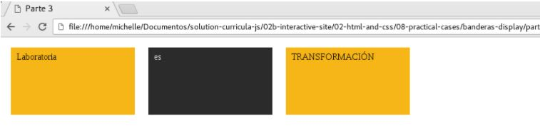

Banderas Display-Parte Tres

1. Autora: Melissa Yauri

2. Objetivo  
El presente trabajo consta de hacer uso de la propiedad "display", en el cual se debe de replicar la imagen adjuntada. De manera que cada bloque se encuentre en una misma línea.

3. Herramientas   
-Html   
-Javascript  
-Css

4. Imagen  

